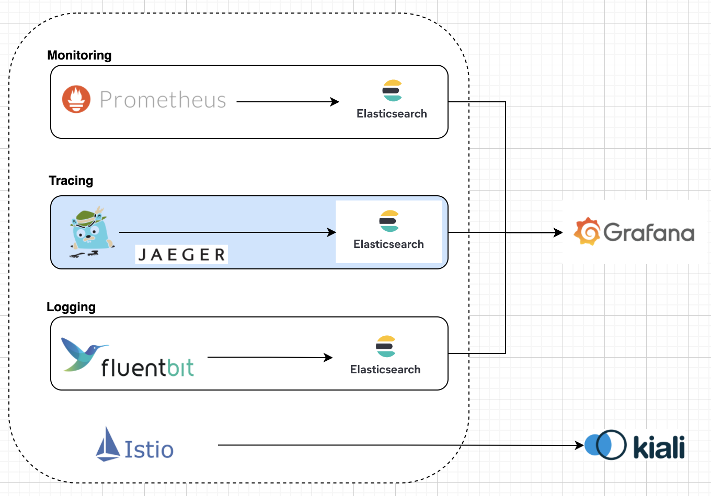
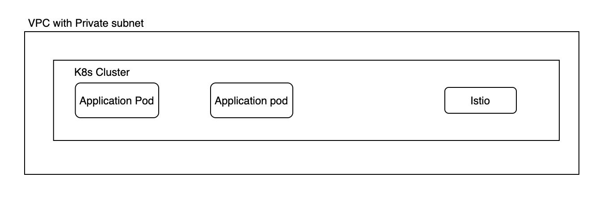

### What problem are we solving?
> Achieve end to end tracing of a request within istio enabled workloads using open source tools regardless of the language, framework, or platform you use to build your application.


### What is Observability?
Observability comprises of three pillars
* Logs
* Metrics
* Traces

For the current project we will focus on tracing.





Private Cluster - Managing application and data workloads.




### What are the Prerequisites?

1. Enable Kubernetes - https://docs.docker.com/desktop/kubernetes/#enable-kubernetes
2. Install Kubectl - https://kubernetes.io/docs/tasks/tools/install-kubectl-macos/#install-with-homebrew-on-macos
3. Install kubectx - https://formulae.brew.sh/formula/kubectx
4. How to switch context - 
    `kubectx' * list all the contexts
    `kubectx docker-desktop' 


### How do I set up?

* Install Elasticsearch to store Jaeger traces - Refer [Documentation](./storage/README.md)
* Deploy Jaeger - Refer [Documentation](./tracing/README.md)
* Install Istio and enable sidecar - Refer [Documentation](./servicemesh/README.md)
* Deploy Grafana in order to visualise the traces - Refer [Documentation](./dashboard/grafana/README.md)
* Deploy Bookinfo application in order to test tracing - Refer [Documentation](./demo/README.md)

### Will it cost me anything?
No - We have used Docker Desktop which includes a standalone Kubernetes server and client. If you are using any other cloud provider please refer the cloud provider's pricing documentation. As a good practice make sure you cleanup the resources at the end.


### How do I clean up?


#### Bookinfo Clean-up
```
kubectl delete -f ./demo/bookinfo.yaml
```
#### Grafana Clean-up
```
kubectl delete -f ./dashboard/grafana.yaml
```
#### Jaeger Clean-up
```
kubectl delete -f ./tracing/jaeger.yaml
kubectl delete -f ./tracing/jaeger-operator.yaml
kubectl delete -f ./tracing/jaeger-role_binding.yaml
kubectl delete -f ./tracing/jaeger-role.yaml
kubectl delete -f ./tracing/jaeger-service_account.yaml
kubectl delete -f ./tracing/jaeger-crd.yaml
```
kubectl delete secret jaeger-secret
```
#### Elasticsearch Clean-up
```
kubectl delete -f elasticsearch.yaml
kubectl delete -f https://download.elastic.co/downloads/eck/1.8.0/operator.yaml
kubectl delete -f https://download.elastic.co/downloads/eck/1.8.0/crds.yaml
```
#### Istio Clean-up
```
kubectl delete namespace istio-system
```
