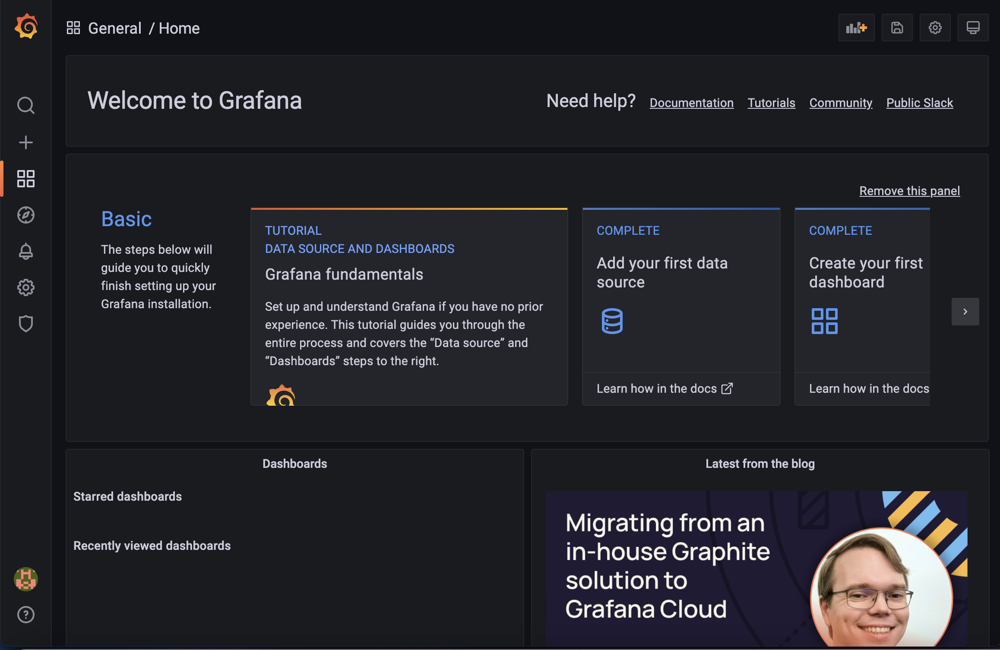
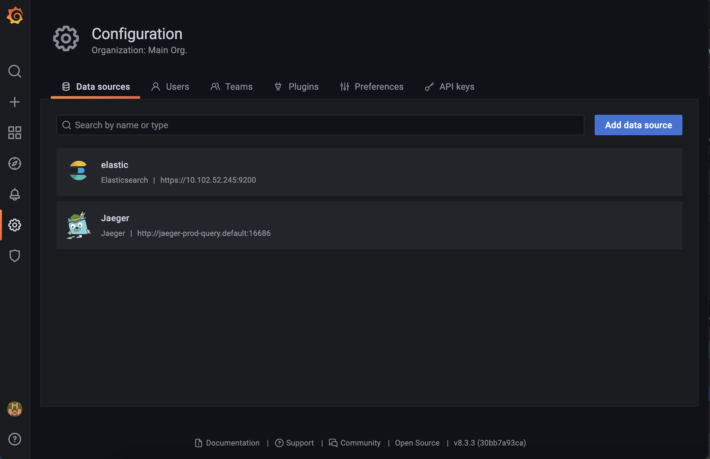
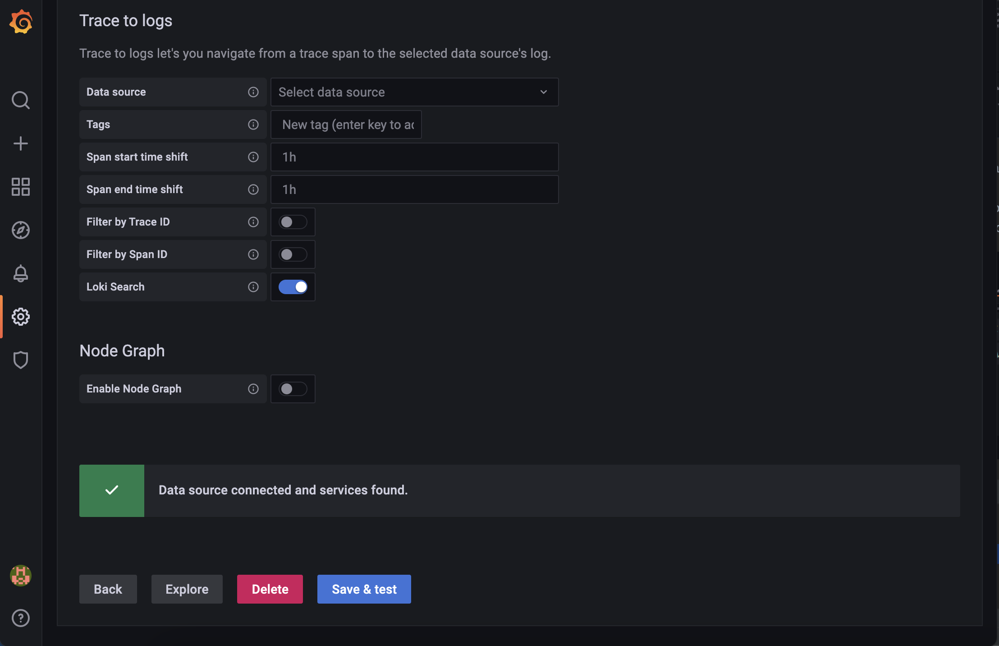
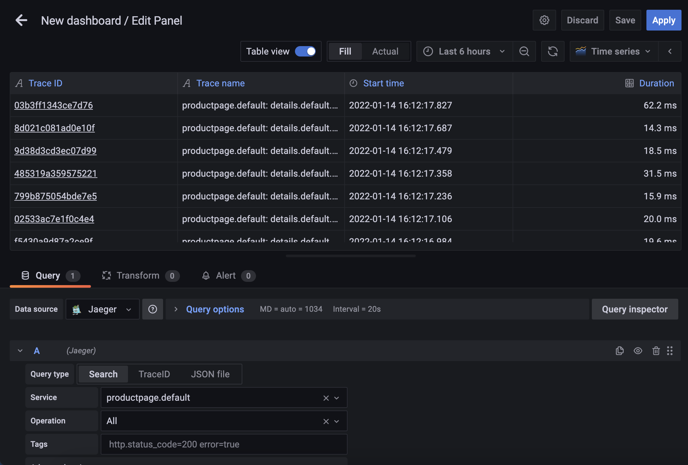

## Grafana Installation

### 1. Modify the server host and password attributes

We need to modify the server host and password in 'grafana.yaml' before we can configure our elasticsearch deployment as a data source. To get both of these attributes:

#### 1) Server host

```
CLUSTER_IP=$(kubectl get svc elasticsearch-es-http -o jsonpath='{.spec.clusterIP}')
```

and then echo this variable in the terminal.

#### 2) Password
    
From the elasticsearch documentation you should have this stored already in the PASSWORD variable, but can be retrieved by:

```
PASSWORD=$(kubectl get secret elasticsearch-es-elastic-user -o go-template='{{.data.elastic | base64decode}}')
```

and then echo this variable in the terminal. 

In grafana.yaml, replace CLUSTER_IP (line 20) and PASSWORD (line 28) with these two attributes.


### 2. Deploy Grafana

Execute the following kubernetes command to deploy Grafana:

```
kubectl apply -f grafana.yaml
```

You can now port-forward Grafana, and using the username and password as both 'admin' log-in - you should see the following UI:



Two data sources are configured to view traces from: for both of the previously set-up Elasticsearch and Jaeger data sources. If you go to Configuration -> Data Sources, you should see them as:



You can then check the connection status by selecting a data source and clicking 'Save and Test' and you should see a successful connection message:




If you have already deployed your application on kubernetes, you can now create a dashboard to view your traces by creating a new dashboard and selecting one of the data sources as a source as shown below:


