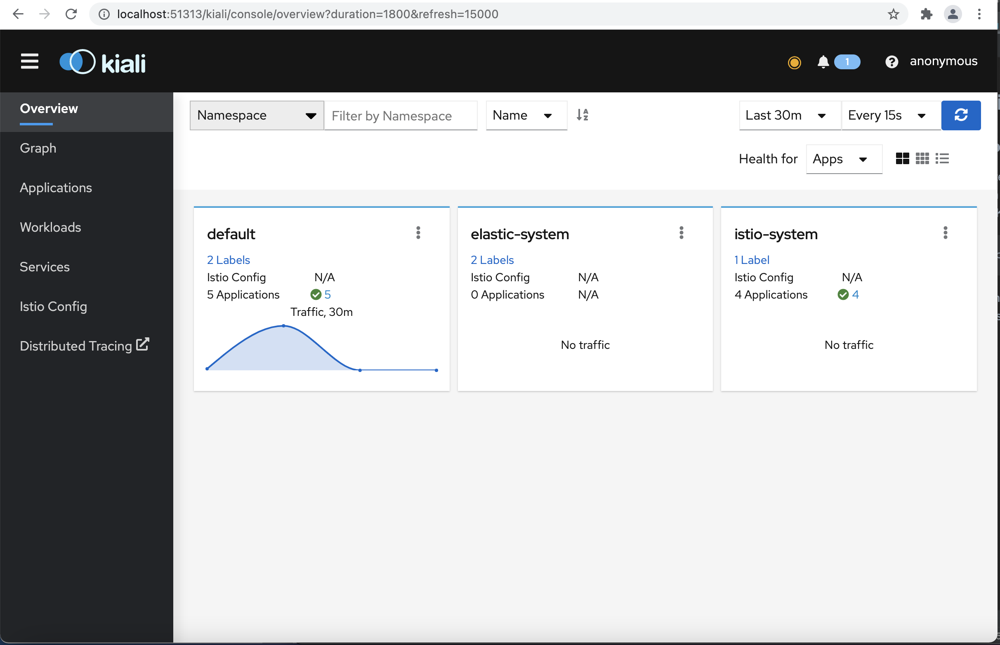
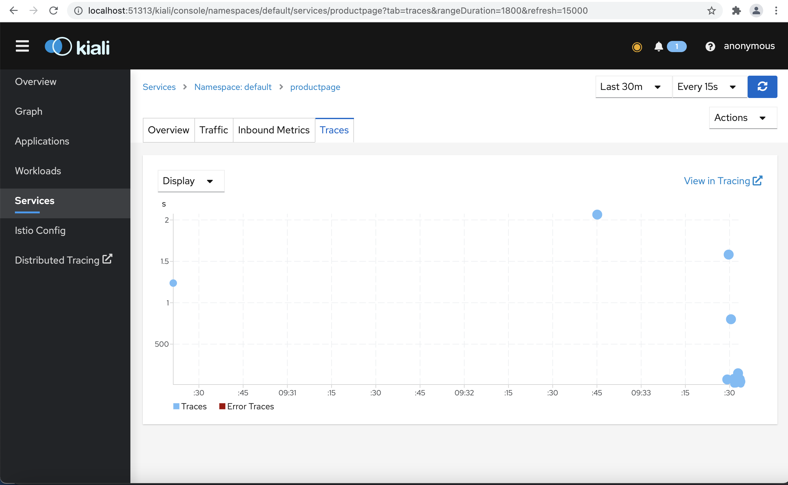
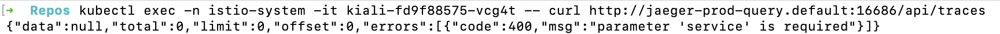
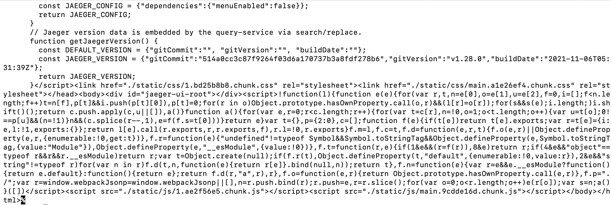

## Kiali Installation

### Deploy Kiali

Firstly, deploy Prometheus using the following command in order to track the health of applications within the service mesh:
```
kubectl apply -f https://raw.githubusercontent.com/istio/istio/release-1.12/samples/addons/prometheus.yaml
```

Navigate to ../grafana/grafana.yaml and perform the following command to deploy Kiali:

```
kubectl apply -f kiali.yaml
```

You can now port-forward Kiali, and should see the following UI:



Note: If you are seeing an error message relating to Prometheus, make sure you have successfully deployed Prometheus in the 'istio-system' namespace using the given kubectl command above.

### Configuring Distributed Tracing with Jaeger

With Jaeger already deployed, Kiali can visualise the application traces itself. Kiali supports in-cluster communication with Jaeger, as well as the ability to provide an external link to the Jaeger UI itself. These are automatically configured in 'kiali.yaml' from line 78 as:
```
external_services:
  tracing:
     in_cluster_url: "http://jaeger-prod-query.default:16685/api/traces"
     url: "http://localhost:64265"
     use_grpc: true
```

where the 'in_cluster_url' has the structure 
```
http://{JAEGER_UI_SERVICE}.{NAMESPACE}:{PORT}/api/traces
```
and the 'url' is the external Jaeger UI, where the port number should be changed as needed.
You can verify this is successful in the UI by navigating to services, finding your desired service and finding the 'Traces' tab which will look similar to the following image:



And note that you can get to the Jaeger UI by clicking the 'Distributed Tracing' tab on the left-hand side.

#### Troubleshooting

Some commonly encountered problems might include:

1. Unable to access Jaeger UI via the 'Distributed Tracing' tab
   1. Ensure that the port number is correct, and if you have hosted Jaeger somewhere other than locally than ensure the host name is correct.
2. Unable to see Jaeger traces within Kiali (e.g. 'traces not found' error message)
   1. This is the most common issue, and stems from an incorrect path to Jaeger. To validate the URL you have specified in 'in_cluster_url', perform the following command:
      ```
      kubectl exec -n istio-system -it <KIALI_POD_NAME> -- curl <IN_CLUSTER_URL>
      ```
      
      where KIALI_POD_NAME is the name of the Kiali pod in the 'istio-system' namespace (get via 'kubectl get pod -n istio-system') and IN_CLUSTER_URL is what you currently have as the 'in_cluster_url'.
      If you see some JSON returned in the form:
      
      then the URL is correctly configured, however if you see blocks of HTML and Javascript returned in the form of:
      
      then the URL is incorrectly configured and so you should check you have the correct Jaeger service name, the correct namespace, the correct port and the correct path. 
   

      Note: The correct port is especially important, because Kiali connects to Jaeger via GRPC on only one specific port (16685).