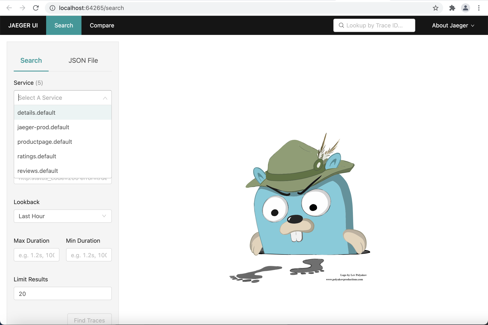
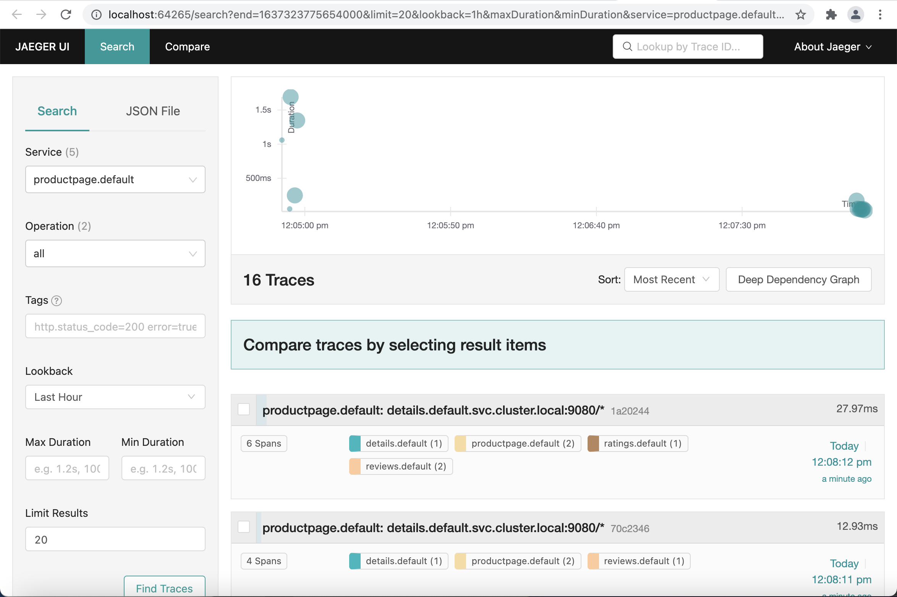
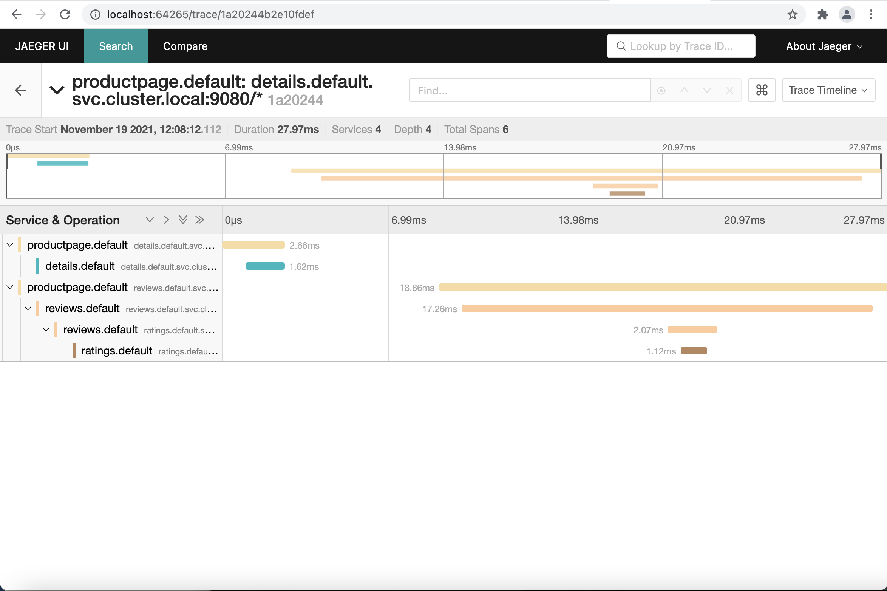

## Jaeger installation

### 1. Install CRDs and RBACs

```
kubectl apply -f ./tracing/jaeger-crd.yaml
kubectl apply -f ./tracing/jaeger-service_account.yaml
kubectl apply -f ./tracing/jaeger-role.yaml
kubectl apply -f ./tracing/jaeger-role_binding.yaml
kubectl apply -f ./tracing/jaeger-operator.yaml
```

### 2. Create production ready Jaeger instance

* Apply below command to deploy the relevant Jaeger resources
    ```
    kubectl apply -f ./tracing/jaeger.yaml
    ```

### 3. Navigate to the UI
* Port forward ```kubectl  port-forward service/jaeger-prod-query 16686```
* or use LENS IDE 





### TODO: Configuring remote access to Jaeger


kubectl config --kubeconfig=config-demo set-context dev-frontend --cluster=development --namespace=frontend --user=developer